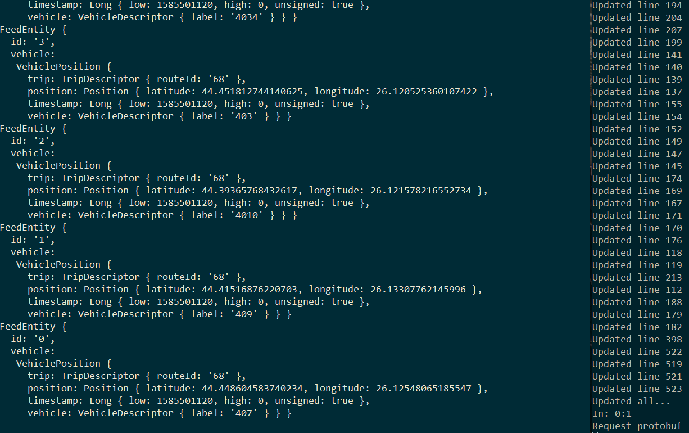

# Iasi GTFS Realtime Vehicle Positions
Convert public GPS data for the Iași city to industry-standard GTFS-Realtime protocol buffer

1. Clone and change directory
```
git clone https://github.com/FlashWebIT/Bucharest-Constanta-GTFS-Realtime-Vehicle-Positions.git
cd Iasi-GTFS-Realtime-Vehicle-Positions
```
2. Install deps
```
npm install
```
3. Run
```
node .
```
4. Test
```
node tester.js
```
5. Daemonize? Use forever, nodemon or screen to run in background.

Protocol buffer GTFS Realtime feed is accessible at http://localhost:3000/positions



You can plug your favourite transit app to that - OpenTripPlanner, etc.

### To do
- [ ] Calculate speed between requests to complete missing field
